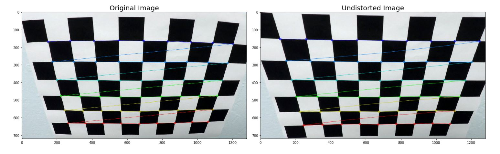
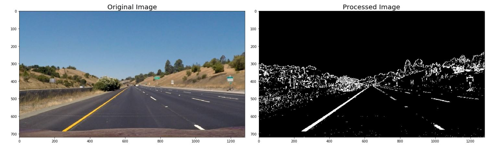
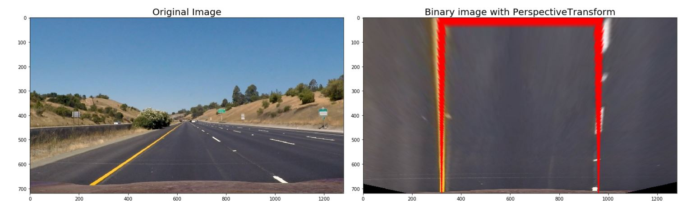
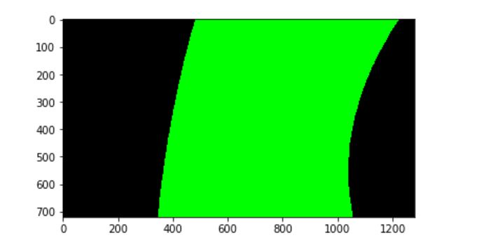

# Advanced Lane Finding Project
- by NK Zou  

### The goals / steps of this project are the following:

* Compute the camera calibration matrix and distortion coefficients given a set of chessboard images.
* Apply a distortion correction to raw images.
* Use color transforms, gradients, etc., to create a thresholded binary image.
* Apply a perspective transform to rectify binary image ("birds-eye view").
* Detect lane pixels and fit to find the lane boundary.
* Determine the curvature of the lane and vehicle position with respect to center.
* Warp the detected lane boundaries back onto the original image.
* Output visual display of the lane boundaries and numerical estimation of lane curvature and vehicle position.

---

# Rubric Points

### 1- Writeup / README
#### Provide a Writeup / README that includes all the rubric points and how you addressed each one.
  
This document is a writeup.    

### 2- Camera Calibration
#### Briefly state how you computed the camera matrix and distortion coefficients. Provide an example of a distortion corrected calibration image.
  
1) The code for this step is contained in the first code cell of the IPython notebook 
located in Advanced_Lane_Finding.ipynb [section 1.1].  
2) I follow the steps and advices given by Udacity, 
collect object point and image point by np.zero() and cv2.findChessboardCorners(), 
compute matrix and distortion coefficients from image by cv2.calibrateCamera().  
  

### 3- Pipeline (test images)

#### 3.1- Provide an example of a distortion-corrected image.
  
This image contains 3.1 and 3.2   
  

#### 3.2- Describe how (and identify where in your code) you used color transforms, gradients or other methods to create a thresholded binary image. Provide an example of a binary image result.
    
1) The code for this step is contained in the first code cell of the IPython notebook 
located in Advanced_Lane_Finding.ipynb [section 1.2].  
2) I have tried each channel of HLS and found S channel is best in all of test images.  
3) I decided only use sobel x to gradient since x is better than y in this case, but I will thnik to use both in the future.  
4) combined HLS and gradient as a final binary image by np.zeros_like() .  
5) See 3.1 for binary image.  

#### 3.3- Describe how (and identify where in your code) you performed a perspective transform and provide an example of a transformed image.
  
1) The code for this step is contained in the first code cell of the IPython notebook 
located in Advanced_Lane_Finding.ipynb [section 1.3].  
2) I follow the steps and advices given by Udacity, use this formula to compute source and destination points,  
```
src = np.float32(
    [[(img_size[0] / 2) - 55, img_size[1] / 2 + 100],
    [((img_size[0] / 6) - 10), img_size[1]],
    [(img_size[0] * 5 / 6) + 60, img_size[1]],
    [(img_size[0] / 2 + 55), img_size[1] / 2 + 100]])
dst = np.float32(
    [[(img_size[0] / 4), 0],
    [(img_size[0] / 4), img_size[1]],
    [(img_size[0] * 3 / 4), img_size[1]],
    [(img_size[0] * 3 / 4), 0]])
```    
3) I verified that my perspective transform was working as expected by drawing the src and dst points onto image.  
  

#### 3.4- Describe how (and identify where in your code) you identified lane-line pixels and fit their positions with a polynomial?
  
1) The code for this step is contained in the first code cell of the IPython notebook 
located in Advanced_Lane_Finding.ipynb [section 2.1].  
2) In find_lane(), I compute histogram and find the peak points, then search and store left lane pixels to define y bounds and computer x bounds. 
I limit distance less than 75 pix to avoid candidate pixel go too far from previous point. 
And then duplicate of left lane algorithm with minor changes to search and store right lane pixels.  
3) In line class, identify lane pixels stored by find_lane(), compute curves and fit polynomial by getFilteredLine(), but I didn't plot in this step, 
I just use them to creat a overlay by over_lay(), so I provide a overlay image in here.  
  

#### 3.5- Describe how (and identify where in your code) you calculated the radius of curvature of the lane and the position of the vehicle with respect to center.
  
1) The code for this step is contained in the first code cell of the IPython notebook 
located in Advanced_Lane_Finding.ipynb [section 2.1] pos_err() and lane_curvature().  
2) I computed the position error by measuring the difference between the image center (image width divided by 2) and the real lane center. 
I used the conversion ratio to convert this pixel difference into meters.  
3) I use the maximum y-value for the radius of curvature. Because it is close to the vehicle, the curve can reflect the steering angles. 
Then use
```
left_curve_radius = ((1 + (2*left_fit[0]*y_eval + left_fit[1])**2)**1.5)/np.absolute(2*left_fit[0])
right_curve_radius = ((1 + (2*right_fit[0]*y_eval + right_fit[1])**2)**1.5)/np.absolute(2*right_fit[0])
```   
to computer curve_radius of left and right lane lines.  

#### 3.6- Provide an example image of your result plotted back down onto the road such that the lane area is identified clearly.
  
The code for this step is contained in the first code cell of the IPython notebook 
located in Advanced_Lane_Finding.ipynb [section 2.1] pipeline().  
  

### 4- Pipeline (video)
#### Provide a link to your final video output. Your pipeline should perform reasonably well on the entire project video. Wobbly lines are ok but no catastrophic failures that would cause the car to drive off the road!

[Completed Project Video](https://twitter.com/samurai_robot/status/828771121742819328)  

### 5- Discussion
#### Briefly discuss any problems / issues you faced in your implementation of this project. Where will your pipeline likely fail? What could you do to make it more robust?
  
1) Hight performance on project video, providing a smooth and accurate segmentation of the lane, but still adapting quickly to small variations due to road bumps.  
2) Perform well on challenge video in most of the time. But it will be affected by noisy edges input that is come from a padded road in some special situation.  
3) I guess I am failed on harder challenge video. It can stay in the safe lane in the most of the time. 
But the overlay is overflow lane line, and almost gets lost on a few occasions like shade conditions and quite steep turns.  
4) I will try to improve pipeline in the future by these solutions:  
* Reduce the picture size that goes through the pipeline to gain more fps, and try to use convolutional neural network on lane detection.  
* Save and move average the lane data points, or fitted curves.  
* Fit a circle formula rather than polynomial function, and find the center point of that circle.  
* Compute the skeleton on edges masks, and then remove small noise components, keeping only long lines.  
It would help the RANSAC algorithm by removing quite a lot of noisy points, and also speed up computation by reducing the number of iterate points.  